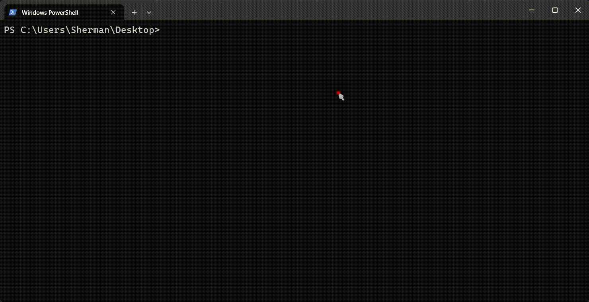

# @shermant/i18n-translator Preview

[English](./README.md) | [中文](./README.zh.md)

A web-based preview and testing environment for the i18n-translator package.

**[🔗 Try the Online Preview](https://i18n-translator.netlify.app/)**

## Overview

This package provides an interactive browser-based playground for testing and previewing React components that use the i18n-translator library. It features:

- Live code editor with syntax highlighting
- Built-in terminal for running commands
- WebContainer integration for real-time code execution
- Synchronous file updates for immediate feedback

## Components

The preview environment consists of:

- **Code Editor**: Interactive JavaScript editor with syntax highlighting powered by Prism.js
- **Terminal**: Interactive terminal powered by xterm.js
- **WebContainer**: Virtual container that executes the code in an isolated environment

## Files

- `index.html`: Main HTML layout for the preview interface
- `main.js`: Core functionality including editor, terminal, and WebContainer initialization
- `files.js`: Initial file system structure for the WebContainer
- `style.css`: Styling for the preview interface

## Features

### Synchronous File Updates

The editor implements real-time synchronous updates to the WebContainer file system. When code changes in the editor, it's immediately written to the corresponding file in the WebContainer, ensuring that the preview is always up-to-date.

### Code Editor

- Syntax highlighting for JavaScript/JSX
- Tab indentation support
- Cursor position preservation during syntax highlighting updates
- IME composition support for international input methods

### Terminal Integration

Provides a full terminal experience powered by xterm.js, allowing you to:
- Run npm commands
- Execute scripts
- View logs and output

## Usage

1. Open the preview in a web browser
2. Edit the React code in the editor panel
3. See output and run commands in the terminal panel
4. Changes are automatically synced to the WebContainer for instant preview

## Development

To modify or extend the preview environment:

1. Update the `files.js` to change the initial file structure
2. Modify `main.js` to add new features or change the behavior
3. Adjust the styles in `style.css` to customize the appearance

## Dependencies

- @xterm/xterm: Terminal emulation
- @xterm/addon-fit: Terminal resizing
- @webcontainer/api: Virtual container for code execution
- Prism.js: Syntax highlighting
